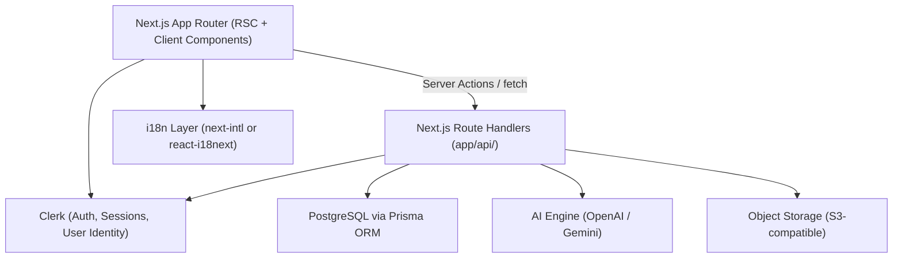
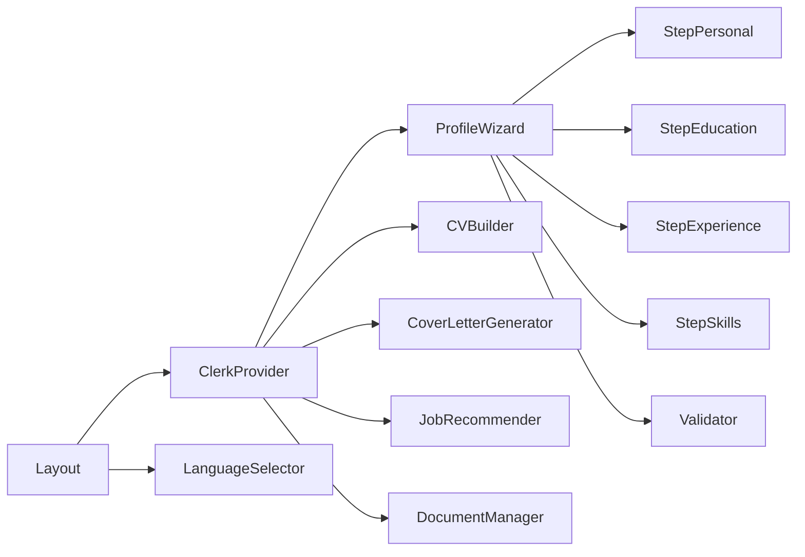

# Design Document: Ethiopia AI CV & Job Assistant

## Overview

The Ethiopia AI CV & Job Assistant is a progressive web application (PWA) that helps Ethiopian job seekers create professional CVs and cover letters, discover job opportunities, and receive career guidance. The system is AI-powered, bilingual (English/Amharic), and optimized for low-bandwidth mobile devices.

The application is a single Next.js project using the App Router. Authentication is fully delegated to Clerk. The database is PostgreSQL accessed via Prisma ORM. The UI is built with shadcn/ui components on top of Tailwind CSS. All API logic lives in Next.js Route Handlers under `app/api/`.

### Key Design Goals

- Sub-5-second initial page load on 3G connections
- AI document generation within 10 seconds
- Full Amharic/English bilingual support with instant language switching
- Secure, session-based authentication with 24-hour inactivity timeout (managed by Clerk)
- Mobile-first responsive layout down to 320px width

---

## Architecture



### Architectural Decisions

1. **Single Next.js project** — eliminates the monorepo overhead; App Router co-locates pages, layouts, and route handlers in one codebase.
2. **Clerk for authentication** — removes all custom JWT/bcrypt/refresh-token logic; Clerk handles registration, login, session management, and the 24-hour inactivity policy via its dashboard settings.
3. **Prisma ORM** — type-safe database access with schema-driven migrations; replaces raw SQL migration files.
4. **shadcn/ui + Tailwind CSS** — accessible, composable UI primitives with zero-runtime CSS; replaces plain CSS.
5. **Server-side AI calls** — the AI API key is never exposed to the client; all LLM requests go through Next.js Route Handlers.
6. **PDF generation server-side** — using Puppeteer in a Route Handler ensures consistent PDF output regardless of client device.
7. **PostgreSQL** — relational model fits the structured profile data and document ownership relationships.

---

## Components and Interfaces

### Frontend Components



| Component | Responsibility |
|---|---|
| `ClerkProvider` | Wraps the app; provides auth context; `middleware.ts` protects routes |
| `ProfileWizard` | Multi-step form using shadcn/ui `Form`, `Input`, `Button`, `Card` |
| `Validator` | Client-side field validation; mirrors server-side rules |
| `CVBuilder` | Triggers CV generation, renders preview, offers PDF download |
| `CoverLetterGenerator` | Accepts job title/company, triggers generation, renders result |
| `JobRecommender` | Displays job and upskilling recommendations from profile |
| `DocumentManager` | Lists, previews, and deletes saved CVs and cover letters |
| `LanguageSelector` | Toggles active locale between `en` and `am` |

shadcn/ui primitives used throughout: `Button`, `Input`, `Textarea`, `Form`, `Card`, `CardContent`, `CardHeader`, `Badge`, `Skeleton`, `Alert`, `Dialog`, `Select`.

### Next.js Route Handlers (`app/api/`)

All routes are protected by Clerk's `auth()` helper. The `userId` returned by `auth()` replaces all JWT user-lookup logic.

| Method | Path | Description |
|---|---|---|
| `GET` | `/api/profile` | Get authenticated user's profile |
| `PUT` | `/api/profile` | Create or update profile |
| `POST` | `/api/cv/generate` | Generate CV from profile via AI |
| `GET` | `/api/cv/[id]` | Retrieve a specific CV |
| `GET` | `/api/cv/[id]/pdf` | Download CV as PDF |
| `POST` | `/api/cover-letter/generate` | Generate cover letter from profile + job details |
| `GET` | `/api/cover-letter/[id]` | Retrieve a specific cover letter |
| `GET` | `/api/cover-letter/[id]/pdf` | Download cover letter as PDF |
| `GET` | `/api/recommendations` | Get job and upskilling recommendations |
| `GET` | `/api/documents` | List all user documents |
| `DELETE` | `/api/documents/[id]` | Delete a document |

Authentication is handled entirely by Clerk — there are no `/api/auth/*` routes.

### AI Engine Interface

```typescript
interface AIEngine {
  generateCV(profile: Profile, language: 'en' | 'am'): Promise<CVContent>;
  generateCoverLetter(profile: Profile, jobTitle: string, company: string, language: 'en' | 'am'): Promise<CoverLetterContent>;
  generateRecommendations(profile: Profile): Promise<RecommendationResult>;
}
```

Timeouts are enforced at 15 seconds per Requirements 2.6 and 3.6. On timeout the adapter rejects with a typed `AITimeoutError`.

---

## Data Models

All models are defined in `prisma/schema.prisma`. Clerk manages user identity; the `clerkUserId` field links Prisma records to Clerk users. There is no `users` table, no `password_hash`, and no `refresh_tokens` table.

### Prisma Schema

```prisma
generator client {
  provider = "prisma-client-js"
}

datasource db {
  provider = "postgresql"
  url      = env("DATABASE_URL")
}

model Profile {
  id          String   @id @default(uuid())
  clerkUserId String   @unique
  personal    Json
  education   Json
  experience  Json
  skills      String[]
  updatedAt   DateTime @updatedAt
}

model Document {
  id          String   @id @default(uuid())
  clerkUserId String
  type        String   // "cv" | "cover_letter"
  language    String   // "en" | "am"
  content     Json
  pdfStorageKey String?
  jobTitle    String?
  company     String?
  createdAt   DateTime @default(now())

  @@index([clerkUserId])
}
```

### TypeScript Types (derived from Prisma)

```typescript
type Profile = {
  id: string;
  clerkUserId: string;
  personal: {
    fullName: string;
    phone: string;
    email: string;
    location: string;
    linkedIn?: string;
  };
  education: EducationEntry[];
  experience: ExperienceEntry[];
  skills: string[];
  updatedAt: Date;
};

type EducationEntry = {
  institution: string;
  degree: string;
  fieldOfStudy: string;
  startYear: number;
  endYear?: number;
};

type ExperienceEntry = {
  company: string;
  title: string;
  startDate: string;
  endDate?: string;
  description: string;
};

type Document = {
  id: string;
  clerkUserId: string;
  type: 'cv' | 'cover_letter';
  language: 'en' | 'am';
  content: object;
  pdfStorageKey?: string;
  jobTitle?: string;
  company?: string;
  createdAt: Date;
};

type RecommendationResult = {
  jobs: JobRecommendation[];
  upskilling: UpskillingResource[];
};

type JobRecommendation = {
  title: string;
  description: string;
  matchReason: string;
};

type UpskillingResource = {
  title: string;
  provider: string;
  url: string;
  relevance: string;
};
```

### Session Management

Clerk manages all session state. The 24-hour inactivity timeout is configured in the Clerk dashboard. Route Handlers call `auth()` from `@clerk/nextjs/server` to obtain the `userId`; a missing or expired session returns `null` and the handler responds with `401`.

---

## Error Handling

| Scenario | Behavior |
|---|---|
| AI timeout (>15s) | Return `503` with `{ error: 'AI_TIMEOUT' }`; client shows retry button |
| AI provider error | Return `502` with `{ error: 'AI_UNAVAILABLE' }`; client shows retry button |
| Invalid profile input | Return `422` with field-level error map; client shows inline errors |
| Unauthenticated request | Clerk middleware redirects to sign-in page (or returns `401` for API routes) |
| Unauthorized document access | Return `403` with `{ error: 'FORBIDDEN' }` |
| Document not found | Return `404` with `{ error: 'NOT_FOUND' }` |

All API error responses follow the shape `{ error: string, details?: object }`.

---

## Correctness Properties

*A property is a characteristic or behavior that should hold true across all valid executions of a system — essentially, a formal statement about what the system should do. Properties serve as the bridge between human-readable specifications and machine-verifiable correctness guarantees.*

### Property 1: Validation rejects invalid input with field-level errors

*For any* profile form submission where one or more required fields are missing or contain invalid data, the Validator SHALL reject the submission and return an error object that identifies each invalid field by name along with a description of the expected format.

**Validates: Requirements 1.2, 1.3**

---

### Property 2: Profile persistence round-trip

*For any* completed user profile, saving the profile to storage and then loading it back SHALL return a profile whose fields are equivalent to the original saved values.

**Validates: Requirements 1.4, 1.5**

---

### Property 3: Generated CV contains all required sections

*For any* user profile submitted to the CV_Builder, the AI-generated CV SHALL contain non-empty sections for personal information, professional summary, education, work experience, and skills.

**Validates: Requirements 2.1, 2.3**

---

### Property 4: Regenerated CV reflects updated profile

*For any* profile that is modified after an initial CV generation, regenerating the CV SHALL produce a document whose content reflects the updated profile data rather than the previous version.

**Validates: Requirements 2.5**

---

### Property 5: Cover letter references profile skills and experience

*For any* user profile, job title, and company name submitted to the Cover_Letter_Generator, the generated cover letter content SHALL reference at least one skill or experience entry from the user's profile.

**Validates: Requirements 3.1, 3.3**

---

### Property 6: Document collection grows with each generation

*For any* sequence of document generation requests by an authenticated user, the total count of documents returned by the document list endpoint SHALL increase by one after each successful generation, and each document SHALL be retrievable individually by its ID.

**Validates: Requirements 3.5, 8.1, 8.3**

---

### Property 7: Job recommendations meet minimum count for non-empty profiles

*For any* user profile containing at least one skill or work experience entry, the Job_Recommender SHALL return a list of at least 5 job recommendations, each containing a non-empty title, description, and match reason.

**Validates: Requirements 4.1, 4.2**

---

### Property 8: Recommendations reflect updated profile

*For any* profile update, fetching recommendations after the update SHALL return results that are consistent with the updated skills and experience rather than the previous profile state.

**Validates: Requirements 4.4**

---

### Property 9: Generated documents respect active language setting

*For any* user profile and active language setting (English or Amharic), documents generated by the CV_Builder or Cover_Letter_Generator SHALL produce content in the language that was active at the time of the generation request.

**Validates: Requirements 5.3, 5.4**

---

### Property 10: All translatable UI strings have Amharic translations

*For any* UI label or instruction string registered in the i18n system, the Amharic locale bundle SHALL contain a non-empty translation for that key.

**Validates: Requirements 5.2**

---

### Property 11: Registration and authentication round-trip

*For any* valid email address and password of at least 8 characters, registering a new account via Clerk and then signing in with the same credentials SHALL succeed and return a valid Clerk session.

**Validates: Requirements 7.1, 7.3**

---

### Property 12: Duplicate email registration is rejected

*For any* email address already associated with an existing Clerk account, a registration attempt with that email SHALL be rejected with an error indicating the email is already in use.

**Validates: Requirements 7.2**

---

### Property 13: Incorrect credentials do not reveal which field failed

*For any* login attempt with incorrect credentials, the error response SHALL not indicate whether the email or the password was the incorrect field.

**Validates: Requirements 7.4**

---

### Property 15: Document list entries contain required metadata

*For any* document in a user's document list, the list entry SHALL include the document type (CV or cover letter), the creation date, and — for cover letters — the job title used during generation.

**Validates: Requirements 8.2**

---

### Property 16: Deleted documents are inaccessible

*For any* document that has been deleted by its owner, subsequent attempts to retrieve that document by ID SHALL return a not-found response.

**Validates: Requirements 8.4**

---

### Property 17: Documents are isolated between users

*For any* document belonging to user A, an authenticated request by user B to access that document SHALL be denied with an authorization error.

**Validates: Requirements 8.5**

---

## Testing Strategy

### Dual Testing Approach

Both unit tests and property-based tests are required. They are complementary:

- **Unit tests** cover specific examples, integration points, and error conditions
- **Property-based tests** verify universal properties across randomly generated inputs

### Property-Based Testing

**Library**: [fast-check](https://github.com/dubzzz/fast-check) (TypeScript)

Each property-based test must:
- Run a minimum of **100 iterations**
- Be tagged with a comment in the format: `Feature: ethiopia-ai-cv-job-assistant, Property N: <property_text>`
- Map 1:1 to a Correctness Property in this document

Example test structure:

```typescript
// Feature: ethiopia-ai-cv-job-assistant, Property 1: Validation rejects invalid input with field-level errors
it('rejects invalid profile input with field-level errors', () => {
  fc.assert(
    fc.property(invalidProfileArbitrary(), (invalidProfile) => {
      const result = validate(invalidProfile);
      expect(result.valid).toBe(false);
      expect(Object.keys(result.errors).length).toBeGreaterThan(0);
      Object.values(result.errors).forEach(msg => expect(msg.length).toBeGreaterThan(0));
    }),
    { numRuns: 100 }
  );
});
```

### Unit Tests

Unit tests should focus on:
- Specific profile CRUD flows (valid and invalid input examples)
- PDF download Route Handler returns `Content-Type: application/pdf`
- Loading indicator renders when `isLoading` state is true
- Language selector switches locale without triggering a full page reload
- Empty profile triggers the "complete your profile" prompt (Requirement 4.5)
- Clerk middleware redirects unauthenticated requests to the sign-in page
- Upskilling resources returned when profile skills don't match high-demand categories (Requirement 4.3)

### AI Integration Testing

AI-dependent tests use a mock/stub `AIEngine` that returns deterministic responses. This allows:
- Testing document structure properties (Properties 3, 5) without live API calls
- Simulating timeout errors to verify retry behavior (Requirements 2.6, 3.6)
- Testing language routing (Property 9) by asserting the language parameter passed to the mock

### Performance Testing

The following are validated via dedicated tooling, not unit tests:
- Initial page load < 5 seconds on 3G (Requirement 6.2) — use Lighthouse CI
- Total initial payload < 500KB (Requirement 6.3) — use `@next/bundle-analyzer`
- AI response within 10 seconds (Requirements 2.2, 3.2) — integration tests with timing assertions
